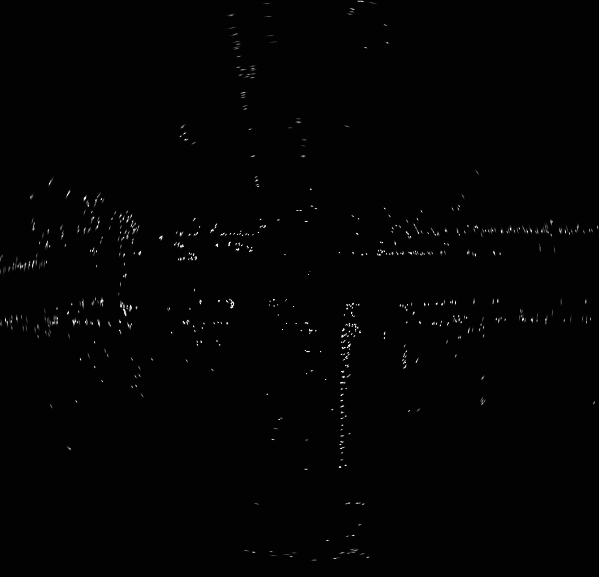
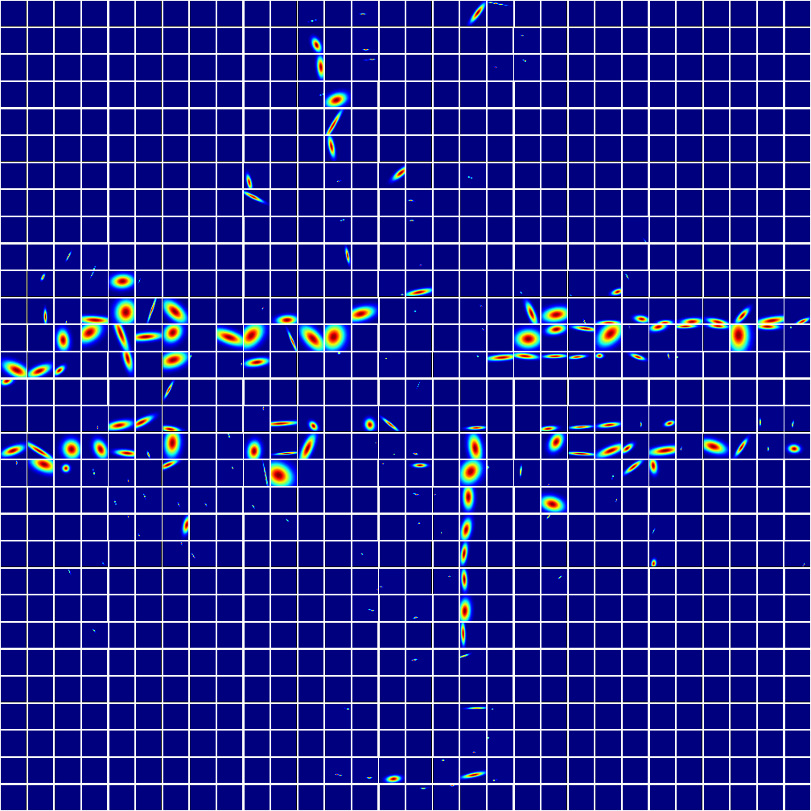

# pw_ndt_automotive_radar_scan_matching

The implementation of automotive radar scan matching proposed in ["A Normal Distribution Transform-Based Radar Odometry Designed For Scanning and Automotive Radars
"](https://arxiv.org/abs/2103.07908) , accepted for publication in the IEEE ICRA 2021. This repo contain four [ROS](http://wiki.ros.org/action/fullsearch/noetic/Installation/Ubuntu?action=fullsearch&context=180&value=linkto%3A%22noetic%2FInstallation%2FUbuntu%22) packages. Please place them in a [catkin workspace](http://wiki.ros.org/catkin/Tutorials/create_a_workspace) to build and run the codes.

## Radar Odometry on nuScences Dataset

- white: LiDAR points
- yellow: Radar points
- red path: ground truth odometry
- blue path: ego-velocity integration ([Kellner et al.](https://ieeexplore.ieee.org/abstract/document/6907064))
- green path: our result

## Testing Environment
```
Ubuntu 16
ROS Kinetic
OpenCV 3.3.1
C++14
Python2.7
```

# Getting Started

### Download nuScenes Dataset in Rosbag Format
You can download the sample data from our server: 
[rosbag1](http://ee904-3.ddns.net:8053/sharing/VPe5tmq8m), 
[rosbag2](http://ee904-3.ddns.net:8053/sharing/MirOEhYVA), 
[rosbag3](http://ee904-3.ddns.net:8053/sharing/oluWKc8d5), 
[rosbag4](http://ee904-3.ddns.net:8053/sharing/r2V0N2S8M)

### Compile the Package
```
$ cd <your catkin workspace>
$ catkin build conti_radar ro_msg radar_odometry nuscenes
```

### Launch the Code
```
$ roslaunch nuscenes tf_nu.launch
$ roslaunch nuscenes radar_GND_RO.launch
```

### Run Rosbag
```
$ cd <where your rosbag locate>
$ rosbag play -r 1 log62_1542193241547892_scene-0997.bag log62_1542193261546825_scene-0998.bag log62_1542193281648047_scene-0999.bag log62_1542193301547950_scene-1000.bag --clock
```

After running the rosbag, you should see:
```
---------------------------------------- 
f time: 1542193320.81622
fl time: 1542193320.84337
fr time: 1542193320.83125
bl time: 1542193320.86423
br time: 1542193320.85886
vel time: 1542193320.81622
iterations_: 31 final eps_: 4.59515e-06
2D Normal Distributions Transform has converged: 1 score: 0.535393
travel_dis: 339.49557
---------------------------------------- 
f time: 1542193320.89124
fl time: 1542193320.91828
fr time: 1542193320.90609
bl time: 1542193320.94426
br time: 1542193320.93456
vel time: 1542193320.89124
iterations_: 31 final eps_: 7.50436e-06
2D Normal Distributions Transform has converged: 1 score: 2.95933
travel_dis: 340.00385
```

### Visualize Result in rviz
```
$ rosrun rviz rviz -d ./config.rviz
```

If you want to visualize doppler measurements of radar, you have to run the following command.
```
$ roslaunch nuscenes radar_viz.launch 
```

Then you should see this in rviz:


- blue arrows: inliers (static objects)
- red arrows: outliers rejected by RANSAC (moving objects or noises)

### Visualize Probabilistic Submap and Normal Distribution Map
```
$ python radar_odometry/src/viz/viz_sd_from_sparse.py
$ python radar_odometry/src/viz/viz_sparse_ndmap.py
```
The result should look like this.

Probabilistic Submap:



Normal Distribution Map:




